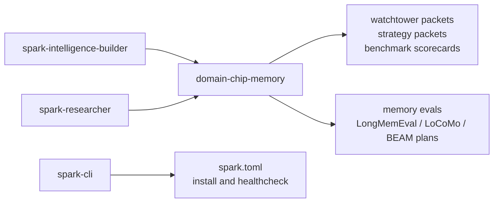
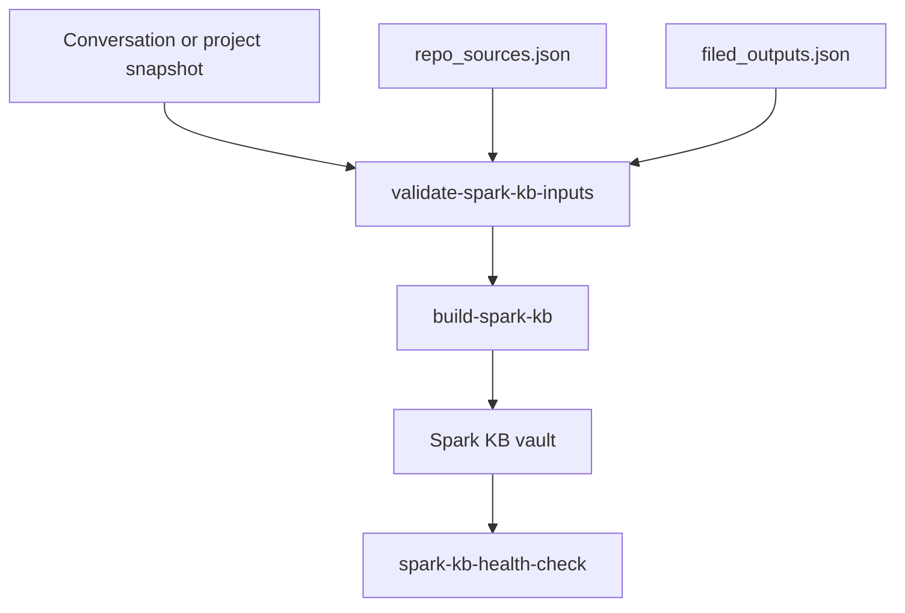

# domain-chip-memory

`domain-chip-memory` is Spark's default memory domain chip. It is a benchmark-first lab for building, testing, and promoting better long-term memory behavior without stuffing memory-engine experiments into the Spark runtime core.

Use this repo when you want to understand or improve Spark memory. Use `spark-intelligence-builder` when you want to operate the runtime. Use `spark-telegram-bot` when you want Telegram ingress. Use `spawner-ui` when you want mission execution.

## Where It Fits



In the Spark starter stack:

- Spark CLI installs this repo as a core module.
- Builder activates it as the default memory chip when discoverable.
- Researcher can use it for memory-packet and chip-authoring workflows.
- The chip does not own Telegram tokens, LLM secrets, Spawner missions, or user ingress.

## What This Repo Owns

- Memory architecture experiments and benchmark scaffolding.
- Watchtower packets and mutation suggestions.
- Evaluation contracts for memory behavior.
- Spark KB validation and build helpers.
- Domain-chip manifests and templates for memory work.

## What This Repo Does Not Own

- Live Telegram bot receiving.
- Runtime identity/session state.
- Cloud provider secrets.
- Spawner mission execution.
- A production memory platform API. This is still a research and promotion scaffold.

## Quick Start

Install editable:

```bash
git clone https://github.com/vibeforge1111/domain-chip-memory
cd domain-chip-memory
python -m pip install -e .
```

Run the local evaluator:

```bash
python evaluate_chip.py
```

Generate the main operator packets:

```bash
python -m domain_chip_memory.cli watchtower --write
python -m domain_chip_memory.cli packets --write
```

Check the Spark installer health path:

```bash
python -m domain_chip_memory.cli watchtower
```

## Agent Operating Guide

If you are an LLM agent reading this repo:

1. Start with this README, then [tasks.md](./tasks.md), then [docs/README.md](./docs/README.md).
2. Treat benchmark/eval claims as evidence-bound. Do not promote a memory strategy from a single offline score.
3. Use the CLI commands below instead of editing generated scorecards by hand.
4. Do not add API keys, chat transcripts, or private memory artifacts to committed docs.
5. Keep launch integration changes in `spark.toml` and documented contracts.
6. If changing memory behavior, also update the relevant validation or benchmark doc.

## Common Commands

```bash
python -m domain_chip_memory.cli benchmark-targets
python -m domain_chip_memory.cli benchmark-contracts
python -m domain_chip_memory.cli baseline-contracts
python -m domain_chip_memory.cli scorecard-contracts
python -m domain_chip_memory.cli canonical-configs
python -m domain_chip_memory.cli loader-contracts
python -m domain_chip_memory.cli provider-contracts
python -m domain_chip_memory.cli runner-contracts
python -m domain_chip_memory.cli memory-system-contracts
```

Spark KB example smoke:

```bash
python docs/examples/spark_kb/run_smoke.py
python -m domain_chip_memory.cli spark-kb-health-check tmp/spark_kb_example
```

Provider-backed bounded benchmark smoke, only after setting the relevant provider key locally:

```bash
python -m domain_chip_memory.cli run-longmemeval-baseline path/to/longmemeval_s_cleaned.json --baseline beam_temporal_atom_router --provider openai:gpt-4.1-mini --limit 1
```

## Eval Results And Current Status

The detailed benchmark/eval ledger is intentionally not kept in the top-level README. It changes often, and a long score dump makes it harder for users and agents to understand how to use the chip.

Start here instead:

- [tasks.md](./tasks.md) - selected architecture and integration checklist
- [docs/README.md](./docs/README.md) - docs index
- [research/README.md](./research/README.md) - research index
- [docs/CURRENT_STATUS_BENCHMARKS_AND_KB_2026-04-09.md](./docs/CURRENT_STATUS_BENCHMARKS_AND_KB_2026-04-09.md) - current benchmark and KB checkpoint
- [docs/MEMORY_SYSTEM_HONEST_ASSESSMENT_2026-03-29.md](./docs/MEMORY_SYSTEM_HONEST_ASSESSMENT_2026-03-29.md) - honest current-state assessment
- [docs/CURRENT_TEST_AND_VALIDATION_PLAN_2026-03-29.md](./docs/CURRENT_TEST_AND_VALIDATION_PLAN_2026-03-29.md) - validation plan
- [docs/FRONTIER_STATUS_2026-03-28.md](./docs/FRONTIER_STATUS_2026-03-28.md) - frontier status

Current launch-level status:

- Status: exploratory, installed by default in the Spark starter stack.
- Purpose: benchmark-grounded long-term memory research and chip behavior.
- Promotion rule: offline evals are not enough; memory changes should stay green across relevant Builder/runtime validation before being treated as launch behavior.

## Spark KB Flow



Example:

```bash
python -m domain_chip_memory.cli validate-spark-kb-inputs docs/examples/spark_kb/snapshot.json --repo-source-manifest docs/examples/spark_kb/manifests/repo_sources.json --filed-output-manifest docs/examples/spark_kb/manifests/filed_outputs.json
python -m domain_chip_memory.cli build-spark-kb docs/examples/spark_kb/snapshot.json tmp/spark_kb_example --repo-source-manifest docs/examples/spark_kb/manifests/repo_sources.json --filed-output-manifest docs/examples/spark_kb/manifests/filed_outputs.json
python -m domain_chip_memory.cli spark-kb-health-check tmp/spark_kb_example
```

## Security Notes

- Do not commit `.env`, provider keys, private memory dumps, private Telegram exports, or user chat transcripts.
- Prefer tiny provider-backed smokes over large secret-bearing benchmark runs in public examples.
- Keep third-party benchmark/code attribution in the relevant docs.
- Use ignored local temp directories for generated KB vaults and scorecards unless the artifact is intentionally public.

## License

See the repository license file.
