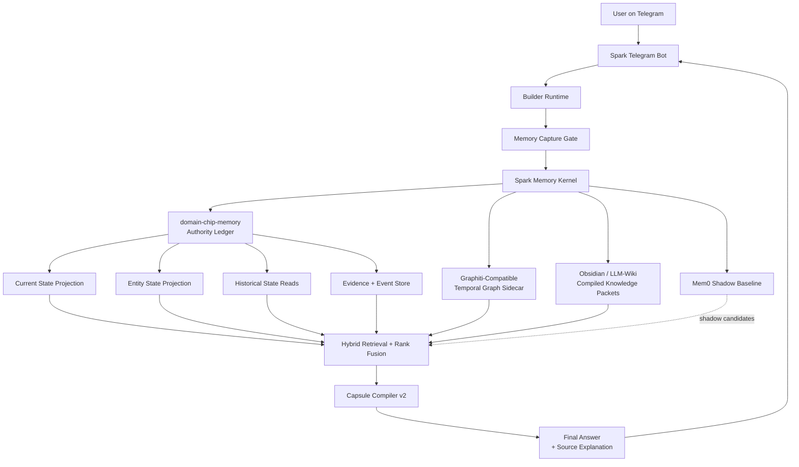
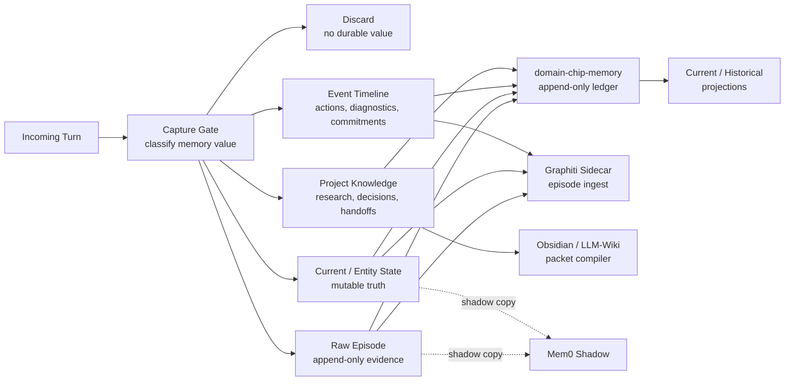
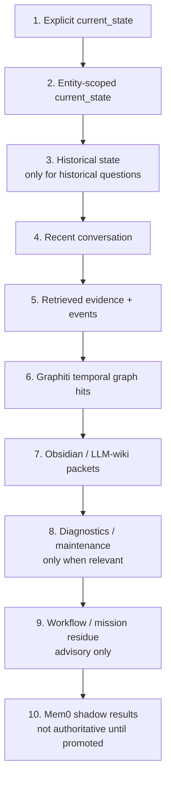
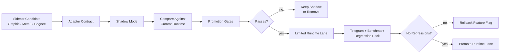
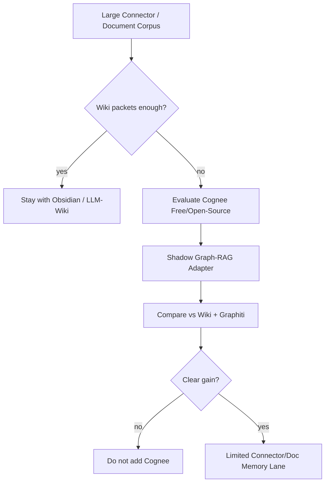
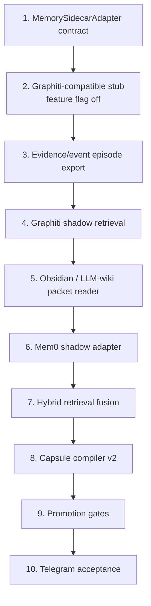

# Memory Stack Diagrams 2026-04-28

These diagrams describe the selected Spark persistent-memory architecture:

- `domain-chip-memory` remains the authority/control plane.
- Graphiti-compatible temporal graph is the first runtime sidecar.
- Mem0 is a shadow personal-memory baseline.
- Obsidian / LLM-wiki packets replace Cognee for now as the compiled project-knowledge layer.
- Cognee stays optional for later document/connector-scale graph-RAG needs.

## 1. System Architecture



## 2. Write Path



## 3. Read Path

```mermaid
flowchart TB
    question["User Question"] --> intent["Query Intent Router"]

    intent --> exact["Exact Current Fact"]
    intent --> mutable["Mutable Entity Fact"]
    intent --> historical["Historical / Previous Value"]
    intent --> relational["Relationship / Event Ordering"]
    intent --> broad["Open-Ended Next Action\nor Project Context"]

    exact --> current["Current State"]
    mutable --> entity["Entity State"]
    historical --> history["Historical State + Evidence"]
    relational --> graph["Graphiti Temporal Graph"]
    broad --> wiki["Obsidian / LLM-Wiki Packets"]
    broad --> evidence["Relevant Evidence / Events"]

    current --> fusion["Rank Fusion"]
    entity --> fusion
    history --> fusion
    graph --> fusion
    wiki --> fusion
    evidence --> fusion
    mem0["Mem0 Shadow Results"] -. compare only .-> fusion

    fusion --> budget["Source-Aware Context Budget"]
    budget --> capsule["Capsule Compiler v2"]
    capsule --> response["Answer"]
```

## 4. Authority Order



Rules:

- Clean diagnostics never close a user focus.
- Maintenance success never closes a user plan.
- Graph hits never override current state unless the query is historical or relational.
- Wiki packets can guide project reasoning, but mutable facts still need ledger-backed state.
- Mem0 shadow results can expose misses, but cannot answer as authority until promoted.

## 5. Sidecar Promotion Flow



Promotion gates:

- current vs stale conflict
- previous-value recall
- open-ended recall
- source-swamp resistance
- identity/entity resolution
- temporal event ordering
- source explanation
- Telegram acceptance probes

## 6. What Cognee Would Add Later



Cognee should not enter the conversational-memory core unless it proves a clear advantage for connector-scale/document-scale memory.

## 7. Implementation Map



This order keeps the architecture clean: first contract, then sidecar, then retrieval, then capsule, then live Telegram acceptance.
