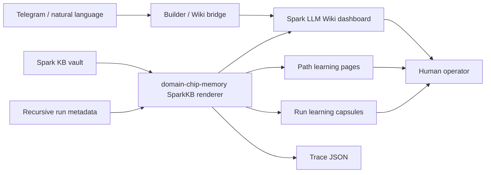

# Spark LLM Wiki Architecture

## Boundary

Spark LLM Wiki is a projection layer over governed evidence. It reads Spark KB packets and recursive run metadata, then renders readable HTML and safe metadata. It does not mutate memory, approve review packets, publish to Spark Swarm, or upgrade evidence tiers.

## Inputs

### Spark KB Vault

Owned by `domain-chip-memory`.

Expected shape:

- `raw/memory-snapshots/latest.json`
- `wiki/**/*.md`
- generated dashboard artifacts under `artifacts/`

Authority:

- `supporting_not_authoritative`
- current-state APIs outrank Wiki summaries for mutable facts

### Recursive Run Wiki

Produced by the Spark Swarm bridge when a specialization path autoloop writes run capsules.

Expected shape:

- `recursive-runs/index.html`
- `recursive-runs/<path-key>/index.html`
- `recursive-runs/<path-key>/<YYYY-MM-DD>/<session-id>.json`
- `recursive-runs/<path-key>/<YYYY-MM-DD>/<session-id>.html`
- `recursive-runs/<path-key>/<YYYY-MM-DD>/<session-id>.md`

Schema:

- `schemaVersion: spark-recursive-wiki-pairing.v1`
- `pathKey`
- `pathLabel`
- `day`
- `sessionId`
- `generatedAt`
- `result`
- `userFacingSummary`
- `boundaries`

The renderer must ignore malformed records, dedupe regenerated sessions, and mark missing run pages as unavailable.

## Rendered Outputs

### Main Dashboard

File:

- `artifacts/spark-kb-dashboard.html`

Purpose:

- First-screen learning journal.
- Agent Brain connection panel.
- Memory movement timeline.
- Spark Memory Flow projection.
- Wiki packet library.
- Safe trace/manifest panel.

### Recursive Learning Projection

Generated next to the dashboard:

- `artifacts/recursive-learning/index.html`
- `artifacts/recursive-learning/<path-key>/index.html`
- `artifacts/recursive-learning/<path-key>/<day>/<session-id>.html`

Purpose:

- Path-level readable learning pages.
- Run-level readable capsules generated from existing metadata.
- Links back to source run capsules when available.

This projection is a local/private view. It should not expose raw audit paths in the human-facing body.

## Data Flow



## Telegram Flow

Telegram stays compact:

```text
Spark QA Operator learned from the latest recursive run.

Score
• current run 0.90
• improved from 0.88

Wiki
• open learning journal
```

Detailed evidence belongs in the Wiki, Workspace, or trace metadata.

Natural-language routing must parse:

```text
intent action + target candidate + evidence expectation + ambiguity state
```

If target or intent is ambiguous, ask a short clarification question.

## Page Types

### Learning Journal Summary

Purpose: first-screen orientation.

Fields:

- latest learned insight
- latest recursive path update
- latest benchmark movement
- review or privacy state
- next useful move

### Path Page

Purpose: path history and capability trajectory.

Fields:

- path label
- run count
- latest run
- current score / best score
- kept / reverted totals
- latest lesson
- next useful move
- run list

### Run Capsule Page

Purpose: readable learning note for one run.

Fields:

- result
- score movement
- completed/requested rounds
- kept/reverted counts
- latest mutation intent
- what Spark learned
- next useful move
- source capsule link when available

## Redaction Rules

Human-facing Markdown and HTML must redact:

- `sscli_...` tokens
- bearer/session/access/refresh tokens
- `sk-...` keys
- long opaque strings
- local absolute paths
- command dumps
- stack traces and tracebacks

Raw audit paths may remain in JSON metadata only when they are needed for local debugging.

## Generalization Rules

Do not hard-code Spark QA Operator behavior into rendering logic.

The renderer should treat path-specific names as metadata. Domain-native intelligence belongs in benchmark packs, specialization paths, domain chips, or autoloop policies, not in dashboard control flow.

The same outer contract should work for:

- Spark QA Operator
- Startup YC
- Crypto Trading
- Domain Chip Creator
- future specialization paths
- future domain chips
- future autoloops

## Testing Plan

Focused tests should cover:

- dashboard renders
- recursive records are loaded
- malformed records are ignored
- duplicated sessions dedupe to the newest record
- path pages render
- run capsule pages render
- missing source HTML links render as unavailable
- human-facing pages redact secrets, local paths, command dumps, and stack traces
- dashboard search indexes recursive summaries

Visual checks should cover:

- desktop dark
- desktop light
- mobile dark
- mobile light
- awkward mid-width layout

## Rollback

The renderer changes are additive. Rollback is safe by reverting:

- recursive record loading
- learning journal HTML section
- recursive-learning output writer

The underlying KB vault and recursive run metadata are not modified.
