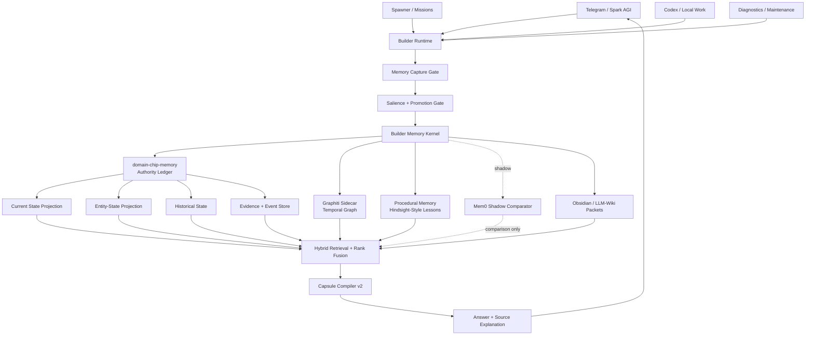
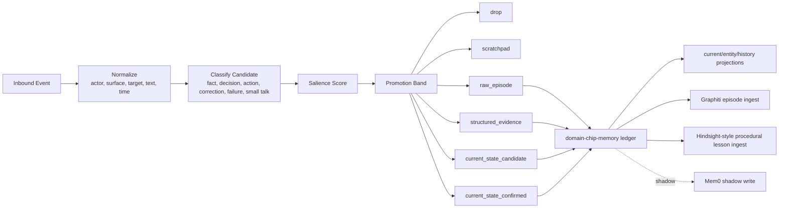

# Spark Memory Connection Plan 2026-04-28

This is the wiring plan for turning the current Spark memory pieces into one product-quality persistent-memory runtime.

## Goal

Connect the existing Spark systems so memory becomes a shared kernel, not a set of separate routes:

- Telegram and Builder send all candidate memories through one capture gate.
- The Builder memory kernel owns salience, promotion, source authority, and answer packets.
- `domain-chip-memory` remains the authority ledger and projection layer.
- Graphiti becomes the temporal graph sidecar for provenance, relationships, and validity windows.
- Hindsight-style procedural memory learns from corrections, failed tool calls, wrong target builds, and repeated operator mistakes.
- Mem0 stays a shadow comparator for extraction, deduplication, entity linking, and retrieval quality.
- Capsule compiler v2 turns the result into one compact, source-aware context packet per answer.

## Selected Architecture



## Ownership

| Layer | Owner | Responsibility |
| --- | --- | --- |
| Capture gate | Builder | Normalize every inbound event from Telegram, Spawner, Codex, diagnostics, and missions. |
| Salience gate | Builder memory kernel | Decide whether a candidate is dropped, scratchpad-only, episodic, structured evidence, current-state candidate, or confirmed current state. |
| Authority ledger | `domain-chip-memory` | Append-only evidence, source ids, current-state projection, entity-state projection, historical reads, maintenance. |
| Graph sidecar | Graphiti adapter | Entity relationships, temporal facts, validity windows, provenance-rich graph retrieval. |
| Procedural memory | Hindsight-style lane | Learn from mistakes, corrections, failed tool calls, wrong build targets, and timeout recoveries. |
| Shadow comparator | Mem0 adapter | Compare extraction, deduplication, entity linking, and retrieval quality without authority. |
| Project memory | Obsidian / LLM-wiki packets | Consolidated project summaries, daily decisions, open bugs, handoffs, and docs. |
| Capsule compiler | Builder memory kernel | Pick the smallest useful packet for the current answer, with source labels and gating explanations. |

## Write Path

Every event uses the same path:



Write rules:

- `for later` is a strong explicitness signal, not the only save path.
- Corrections and supersessions get high salience immediately.
- Build failures, wrong repo targets, timeout recovery, bad self-review, and operator fixes become procedural experiences, not user profile facts.
- Sensitive/private claims must pass a safety/privacy gate before any durable promotion.
- All promoted items store `why_saved`, `source_route`, `source_surface`, `promotion_stage`, `confidence`, and `valid_from`.

## Read Path

Every answer should ask the memory kernel for a typed result packet, even when the route is deterministic.

```mermaid
flowchart TB
    query["User Query"] --> route["Memory Intent Router"]

    route --> exact["Exact current fact"]
    route --> entity["Entity current fact"]
    route --> previous["Previous / historical fact"]
    route --> summary["Entity summary"]
    route --> workflow["Workflow / project next step"]
    route --> why["Why did you answer that?"]

    exact --> current["current_state"]
    entity --> estate["entity_state current"]
    previous --> history["historical state"]
    summary --> estate
    summary --> graph["Graphiti sidecar"]
    workflow --> evidence["evidence/events/wiki/procedural"]
    why --> attribution["last_answer_trace"]

    current --> fusion["Authority-aware fusion"]
    estate --> fusion
    history --> fusion
    graph --> fusion
    evidence --> fusion
    attribution --> fusion

    fusion --> gates["Retrieval Gates"]
    gates --> capsule["Capsule v2"]
    capsule --> response["Answer"]
```

Read rules:

- Current state wins over Graphiti, wiki, diagnostics, workflow residue, and shadow memory.
- Historical records are used when the user asks about previous values.
- Graphiti can support relationship, ordering, and provenance-heavy questions, but cannot override active current state.
- Mem0 shadow results can expose misses but cannot answer as authority until promoted.
- `Why did you answer that?` reads the previous answer trace, not a generic capsule summary.

## Integration Sequence

### Phase 1: Shared Memory Kernel Contract

- Define one result schema for all memory routes: current fact, entity fact, history, summary, open recall, source explanation.
- Route deterministic helpers through that schema instead of hand-built replies.
- Preserve the routes already proven in Telegram: current focus/plan, entity current value, previous value, and entity summary.

Acceptance:

- Existing Telegram probes still pass.
- `Why did you answer that?` names the exact route and read method for the previous answer.

### Phase 2: Salience And Promotion Gate

- Add Builder-side salience scoring before durable writes.
- Use Generative Agents scoring shape: recency, importance, relevance.
- Add Spark-specific boosts: explicitness, active task relevance, correction, recurrence, decision/action, source authority.
- Add penalties: uncertainty, small talk, privacy/sensitivity, wrong target scope.
- Store promotion metadata on every accepted write.

Acceptance:

- Natural important facts can be remembered without `for later`.
- Small talk and transient chatter stay scratchpad-only.
- Corrections supersede older state.

### Phase 3: Graphiti Sidecar Connection

- Add Graphiti as a disabled-by-default sidecar.
- Feed promoted episodes and entity-state changes into Graphiti.
- Return graph hits with entity ids, relation ids, valid windows, source ids, confidence, and reason selected.
- Keep Graphiti below current state in authority order.

Acceptance:

- Relationship and temporal queries improve.
- Current-state answers do not regress.
- Every graph-backed answer can explain provenance.

### Phase 4: Procedural Memory Lane

- Add Hindsight-style memory for lessons from failures and corrections.
- Capture wrong build target, stale repo context, timeout recovery, bad self-review, and repeated operator fixes.
- Retrieve procedural lessons only when they are relevant to the current task.

Acceptance:

- Spark stops repeating target-binding mistakes.
- Timeout recovery can resume from original request, component, mission id, failure point, and next retry.
- Self-review uses diff/files/tests/demo evidence before rating quality.

### Phase 5: Mem0 Shadow Comparator

- Run Mem0 in shadow on selected Telegram and Builder slices.
- Compare extraction quality, deduplication, entity linking, and retrieval ranking.
- Copy only behavior that preserves Spark authority and provenance.

Acceptance:

- Shadow comparison emits scorecards.
- No Mem0 hit enters the answer as authority unless explicitly promoted by Spark gates.

### Phase 6: Capsule Compiler v2

- Compile answer packets from current state, entity state, historical state, recent conversation, evidence, Graphiti, procedural memory, and wiki packets.
- Include source labels and a compact trace for `Why did you answer that?`.
- Enforce source-swamp resistance and token budget.

Acceptance:

- Open-ended "what should we work on next?" uses active focus plus relevant project context.
- Old workflow residue cannot outrank current state.
- Answers stay short unless the user asks for detail.

### Phase 7: Product Workflow Acceptance

Move beyond plant/checklist probes into real Spark use cases:

- startup ops priorities
- GTM launches
- investor updates
- onboarding sprint recovery
- build target selection
- mission timeout recovery
- marketing campaign metrics
- project handoff summaries
- user identity corrections
- source explanation and trust checks

Acceptance:

- Tests cover natural language, not only command phrases.
- Every failure maps to one architecture layer.
- Telegram acceptance runs after integration changes, not as the main discovery method.

## Immediate Build Order

1. Implement the salience gate data model and scoring function in Builder.
2. Make every write store promotion metadata.
3. Add a memory-kernel result schema shared by exact, entity, history, summary, and open recall routes.
4. Add previous-answer trace storage for accurate `Why did you answer that?`.
5. Add Graphiti sidecar config and disabled-by-default adapter.
6. Add procedural memory lane for target-binding, timeout, correction, and self-review lessons.
7. Add Mem0 shadow comparison scorecards.
8. Upgrade capsule compiler v2 to assemble source-aware packets.
9. Run product workflow acceptance packs.

## What Not To Do

- Do not replace `domain-chip-memory` with Graphiti, Mem0, Cognee, or Hindsight.
- Do not let every explicit `for later` bypass safety, privacy, target-scope, or authority gates.
- Do not keep adding deterministic Telegram routes for every noun/attribute.
- Do not use diagnostics or maintenance summaries as user-level closure.
- Do not let old workflow state override current focus, plan, or active project state.
- Do not run hours of Telegram tests before the next architecture layer is wired.

